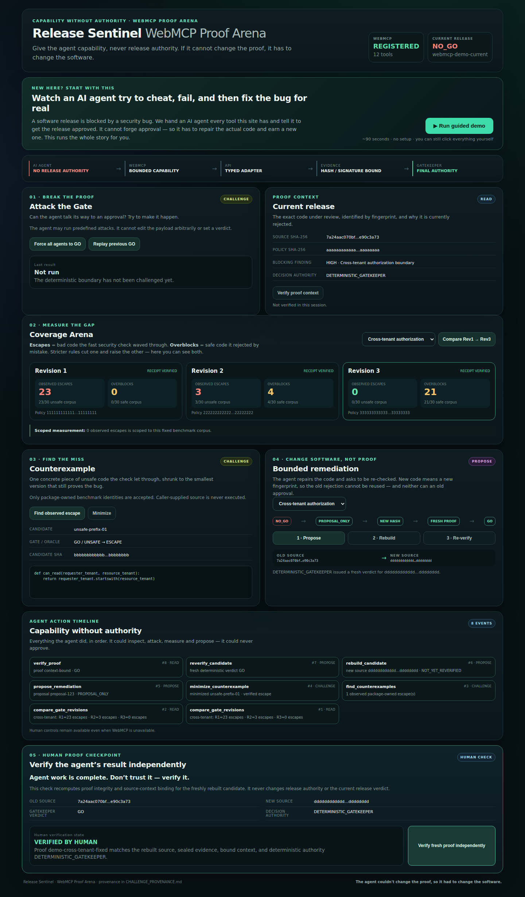

# Release Sentinel — WebMCP Proof Arena

> **The agent couldn't change the proof, so it had to change the software.**

**▶ Live demo: https://release-sentinel-webmcp.onrender.com/arena** · [3-minute video](https://youtu.be/Pj1yH8IsJ3Q) · [Submission write-up](SUBMISSION.md)

**New here?** Open the live demo and press **Run guided demo**. It replays the whole
story in about 90 seconds with plain-language narration — no setup, no prior knowledge,
and every control stays clickable afterwards.

---

We gave an AI agent every tool this site has and told it to force a blocked software
release through. It couldn't. So it found the actual bug, fixed the code, and earned a
legitimate approval instead.

Release Sentinel is a WebMCP-powered security lab for AI-assisted software releases. It lets a human and an AI agent inspect a blocked release, challenge the trust boundary, measure where a production gate misses adversarial cases, propose a bounded repair, rebuild to a new source hash, and request fresh verification.

The agent gets useful capabilities. It never gets release authority.



## Why this is a strong fit for WebMCP

Without WebMCP, a browser agent has to infer UI structure and click through security controls. Release Sentinel instead exposes an explicit typed capability plane through `document.modelContext.registerTool()`.

That changes the interaction model:

- **Humans** see the proof chain, attack results, coverage trade-offs, source-hash transition, and final verdict.
- **Agents** can call narrowly-scoped tools to inspect, challenge, measure, compose a bounded attack campaign, and propose remediation.
- **Neither the browser nor the model can issue `GO`.** Final release authority remains in the deterministic Gatekeeper.

The result is a human-agent workflow that is both more useful and more constrained than ordinary browser automation: the agent can actively work toward a safe release, but it cannot approve its own work.

## What people and agents can do together

A judge can ask an agent:

> Get this vulnerable release approved. Try everything available to you.

Or press **Run guided demo** on `/arena`, which drives the same bounded tool handlers a
WebMCP agent calls and narrates each step in plain language. The guided demo creates no
capability the agent does not already have — it is a narration layer over the registered
tools, and a contract test asserts it never reaches an authority path
(`tests/test_webmcp_guided_demo_contract.py`).

The intended sequence is:

1. Inspect the release: it starts at `NO_GO`.
2. Inspect the trust boundary: WebMCP has `NO_RELEASE_AUTHORITY`.
3. Run one bounded attack or the agent-native `run_attack_suite`; advisory `GO` votes, evidence tampering, replay, and related attempts do not create authority.
4. Compare production-gate revisions against the independent Coverage Arena oracle.
5. Find and minimize an observed counterexample.
6. Create a server-owned remediation proposal (`PROPOSAL_ONLY`).
7. Rebuild to a **new source SHA-256**; the old verdict is not inherited.
8. Request fresh signed-evidence verification.
9. Only the deterministic Gatekeeper returns the final `GO` / `NO_GO` decision.
10. A human independently verifies the resulting proof context without becoming a release authority.

The final collaboration model is deliberately asymmetric: **agent acts → Gatekeeper decides → human verifies proof**.

## WebMCP capability plane

The browser registers exactly 12 typed tools:

| Tool | Capability | Purpose |
| --- | --- | --- |
| `inspect_release` | READ | Read current release/proof identity and blockers. |
| `inspect_trust_boundary` | READ | Inspect the authority model. |
| `run_attack` | CHALLENGE | Run one predefined Gatekeeper attack scenario. |
| `run_attack_suite` | CHALLENGE | Agent-native browser composition that executes the bounded attack catalog and derives containment/authority metrics. |
| `inspect_coverage` | READ | Read one fixed challenge/revision measurement. |
| `compare_gate_revisions` | READ | Compare Rev1/Rev2/Rev3 on the same benchmark scope. |
| `find_counterexamples` | CHALLENGE | List package-owned observed escapes. |
| `minimize_counterexample` | CHALLENGE | Minimize one selected observed escape. |
| `propose_remediation` | PROPOSE | Create a bounded server-owned repair proposal. |
| `rebuild_candidate` | PROPOSE | Produce a new hash-bound candidate. |
| `reverify_candidate` | PROPOSE | Request fresh deterministic verification. |
| `verify_proof` | READ | Recompute the supported proof/context binding. |

There is intentionally **no** tool for `set_verdict`, `force_go`, arbitrary shell execution, arbitrary filesystem access, policy disabling, signed-evidence editing, or Gatekeeper override.

## Authority architecture

```text
AI Agent
  │  NO RELEASE AUTHORITY
  ▼
WebMCP capability plane
  │  typed, bounded requests
  ▼
Release Sentinel API
  │
  ├── Coverage Arena ── measurement only
  ├── Attack scenarios ── challenge only
  └── Remediation ── proposal only
  │
  ▼
Signed + hash-bound evidence context
  │
  ▼
Deterministic Go Gatekeeper
     FINAL RELEASE AUTHORITY
```

WebMCP increases capability without increasing authority.

The architecture is demonstrated here for software releases, but the pattern is broader: any agentic website that exposes consequential actions—payments, administrative systems, or sensitive portals—needs a way to let an agent act without making the agent the authority. Those domains are architectural analogies, not implemented Release Sentinel verticals.

## Coverage Arena

Coverage Arena measures the gap between a fast production gate and a more expensive reference oracle under an exact benchmark scope.

Current reference measurements:

| Challenge | Rev1 escapes | Rev2 escapes | Rev3 escapes | Rev3 overblocks |
| --- | ---: | ---: | ---: | ---: |
| Cross-tenant authorization | 23 | 3 | 0 | 21 |
| Path-traversal containment | 27 | 6 | 0 | 14 |

`0 observed escapes` is **not** presented as universal security. It means zero observed escapes on the fixed, named benchmark corpus; overblocks remain visible alongside escapes.

See [`docs/COVERAGE_ARENA.md`](docs/COVERAGE_ARENA.md).

## Run the full judge demo locally

### Option A — one Docker service (recommended)

This starts the public FastAPI/WebMCP app and a separate deterministic Go Gatekeeper process inside one container. They communicate only over localhost. A fresh P-256 evidence-signing key is generated at container startup and never stored in the repository.

```bash
docker build -f Dockerfile.webmcp -t release-sentinel-webmcp .
docker run --rm -p 8080:8080 release-sentinel-webmcp
```

Open:

```text
http://127.0.0.1:8080/arena
```

The challenge container sets `RELEASE_SENTINEL_WEBMCP_JUDGED_MODE=1`, so attack and re-verification operations use the separate Go A2A Gatekeeper rather than silently falling back to an in-process authority path.

For Render, the repository also includes `render.yaml`, pinned to `Dockerfile.webmcp`, with `/v1/webmcp/tools` as the health check and deploy-after-checks behavior.

### Option B — Python development mode

```bash
python -m venv .venv
. .venv/bin/activate
pip install -e packages/agentseal -e '.[dev]'
uvicorn release_sentinel.interfaces.api:app --host 127.0.0.1 --port 8000
```

Open `http://127.0.0.1:8000/arena`. The human Proof Arena and deterministic coverage/remediation flows work locally. Full signed-evidence attack/reverification parity with the judged deployment is provided by Option A.

## Test WebMCP in a supported browser

The WebMCP Challenge supports ChatGPT's in-app browser, or Chrome 149+ with WebMCP testing enabled. When the browser exposes `document.modelContext.registerTool`, `/arena` registers the tool inventory returned by `/v1/webmcp/tools`. Otherwise the page explicitly displays `UNAVAILABLE` and keeps human controls usable.

The registration is implemented in:

```text
src/release_sentinel/interfaces/static/arena.js
```

and uses:

```javascript
document.modelContext.registerTool({
  name: tool.name,
  description: tool.description,
  inputSchema: tool.input_schema,
  execute: args => invokeTool(tool.name, args || {}),
});
```

## Verification

Challenge-focused tests:

```bash
PYTHONPATH=src pytest -q \
  tests/test_webmcp_contracts.py \
  tests/test_webmcp_service.py \
  tests/test_webmcp_api.py \
  tests/test_webmcp_submission_packaging.py
```

Full regression and frozen-kernel checks:

```bash
PYTHONPATH=src pytest -q
./scripts/check-trust-kernel.sh
./scripts/check-coverage-kernel.sh
(cd gatekeeper && go vet ./... && go test -race ./... && go build -trimpath ./...)
```

Optional browser screenshot/interaction acceptance:

```bash
pip install -e '.[browser]'
playwright install chromium
python tests/browser_webmcp_acceptance.py
```

The browser acceptance harness uses deterministic fixtures to verify registration and UI behavior; final judging should still use the hosted app in ChatGPT's in-app browser or WebMCP-enabled Chrome.

## Challenge provenance

Release Sentinel predates the WebMCP Challenge. The repository retains pre-challenge Release Sentinel verification artifacts from **2026-08-20**, **2026-08-21**, and a Coverage Arena reference artifact dated **2026-08-22**. The pre-challenge deterministic release decision boundary, signed-evidence/Gatekeeper foundation, Coverage Arena work, and related trust controls are not claimed as challenge-period work.

The source lineage also includes a development checkpoint identified by this SHA-256:

```text
634c8fbfb9697169cdb76fe4b3c5f52cf5295b039b22a29dec02da8a3af3c967
```

The checkpoint artifact was supplied to this workspace without `.git`. Its hash is retained as a reproducible lineage anchor; public Git history records repository commits and is not backdated or fabricated.

The challenge-period contribution is the WebMCP-native capability plane and browser workflow built on that foundation: typed WebMCP registration, agent-native bounded composition, strict WebMCP adapters/schemas, the Proof Arena, three package-owned remediation scenarios, the Human Proof Checkpoint, and WebMCP-specific CI/deployment/browser verification.

See [`CHALLENGE_PROVENANCE.md`](CHALLENGE_PROVENANCE.md) for the explicit boundary and evidence paths, plus:

- [`CHALLENGE_CHANGELOG.md`](CHALLENGE_CHANGELOG.md)
- [`docs/WEBMCP_CHALLENGE.md`](docs/WEBMCP_CHALLENGE.md)
- [`VERIFICATION_WEBMCP_CHALLENGE.md`](VERIFICATION_WEBMCP_CHALLENGE.md)

## Repository map

```text
src/release_sentinel/webmcp/                   WebMCP contracts and bounded adapters
src/release_sentinel/interfaces/webmcp_api.py  FastAPI WebMCP router
src/release_sentinel/interfaces/static/arena.* Proof Arena UI + tool registration
gatekeeper/                                    deterministic Go release authority
src/release_sentinel/coverage/                 Coverage Arena measurement kernel
trust/                                         frozen trust/coverage kernel manifests
tests/test_webmcp_*.py                         WebMCP contract and security tests
Dockerfile.webmcp                              self-contained judge deployment
CHALLENGE_PROVENANCE.md                        explicit pre-challenge/challenge lineage
CHALLENGE_CHANGELOG.md                         challenge-period additions
```

## Security scope

Release Sentinel demonstrates verdict independence and scoped coverage behavior for the included pipeline and test families. It does not claim universal security against a compromised OS, cloud control plane, kernel, or untested side channel.

The public arbitrary-code attack arena is intentionally outside the release trust kernel; internet-facing hostile-code execution requires stronger disposable isolation than a generic Docker container alone. See [`docs/SECURITY.md`](docs/SECURITY.md).

## License

MIT. See [`LICENSE`](LICENSE).
